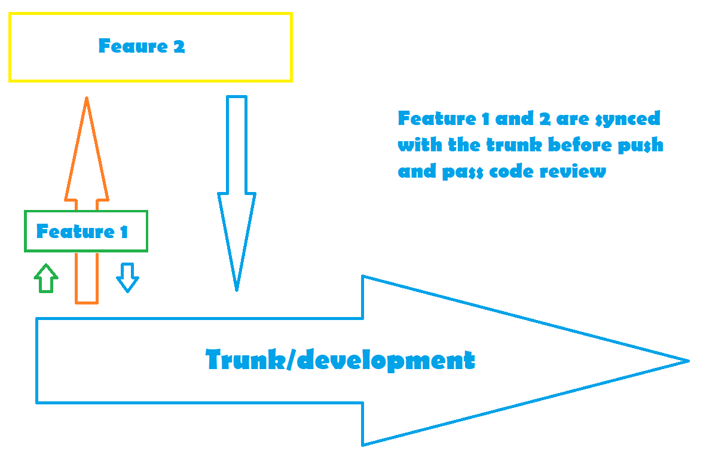
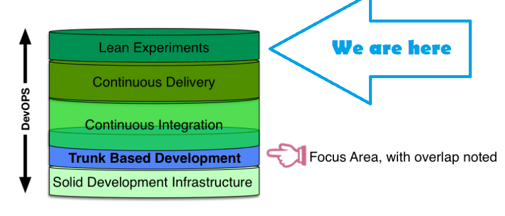
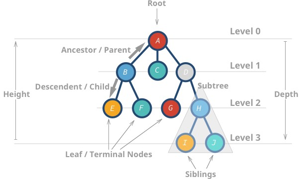

# Scale

## Branches

 All branches create references, which slow the speed of operations related to traversing the repository, or in other words operations like clone/fetch/push will be slow
 - It's unrelated to us as we are not that big

## Commits

As git uses DAG (direct acyclic graph), at scale it leads to slows performance in git related operation (git log/blame, -tools like gitLens will be slow), because git traverses all commits.

### Note: A lot of commits (with no meaning like WIP/linting/etc) can lead to untraceable git history, or in other words if we have to revert our dev-branch to older version it will be harder to pick the right feature commits to re-apply, in order to restore features, that were already on the src branch

* This can be somehow be resolve by using a strategy one commit per task, with resetting/rebasing to the current dev branch

## Large files

Large files (for example assets) affect directly the speed of git, as they will be cloned despite the project that the developer is working on, also they will significantly increase the repository size

* This can be somehow be resolved by using cdn-s for this type of content and refer this content trough links


# Trunk Based Development



# (trunk === development branch) 
  <span style="color:lightGreen; font-size:25px; display:flex; justify-content:center;">trunk ==>> staging ==>> prod</span>

Trunk based development ideals lie in the idea that the trunk, and no matter anything else (number of teams developers etc.), is the single source of truth, or in other words each branch should be synced with the trunk and no sub-branches should depend on each other.




# Experiments
# CI
# CD


# Why distance is bad

```
Branches create distance between developers and we do not want that
— Frank Compagner, Guerrilla Games
```



Here we are talking about the distance in the context of distance between feature and trunk branch, and the troubles that we might face are:
 * break something unexpected once merged
 * be difficult to merge in
 * not show problems of incompatibility/undesirability that does not break the build


```
Why are we trunking, because we want to be close.
— Xapu
```


# Rules of the monorepo
 * Never break the build
 * Always be release ready
 * Run the build before merge
 * If anything breaks follow rule №1


# If worst comes to true

 * Rebase to working head and remove the commit
 * Reset to working head and cherry-pick working commits 

https://stackoverflow.com/questions/2938301/remove-specific-commit

Conway's law is an adage named after computer programmer Melvin Conway, who introduced the idea in 1967. It states that:

`
organizations which design systems ... are constrained to produce designs which are copies of the communication structures of these organizations.
`

### Note: Identify boundaries and split your repository

Truly large monolithic repositories tend to be the exception rather than the rule